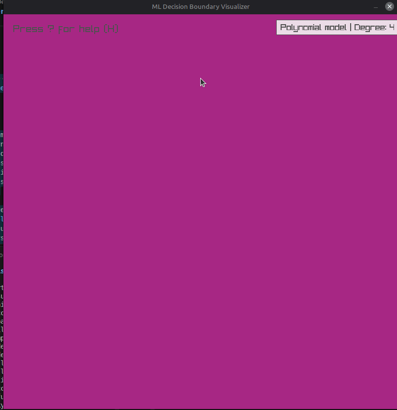
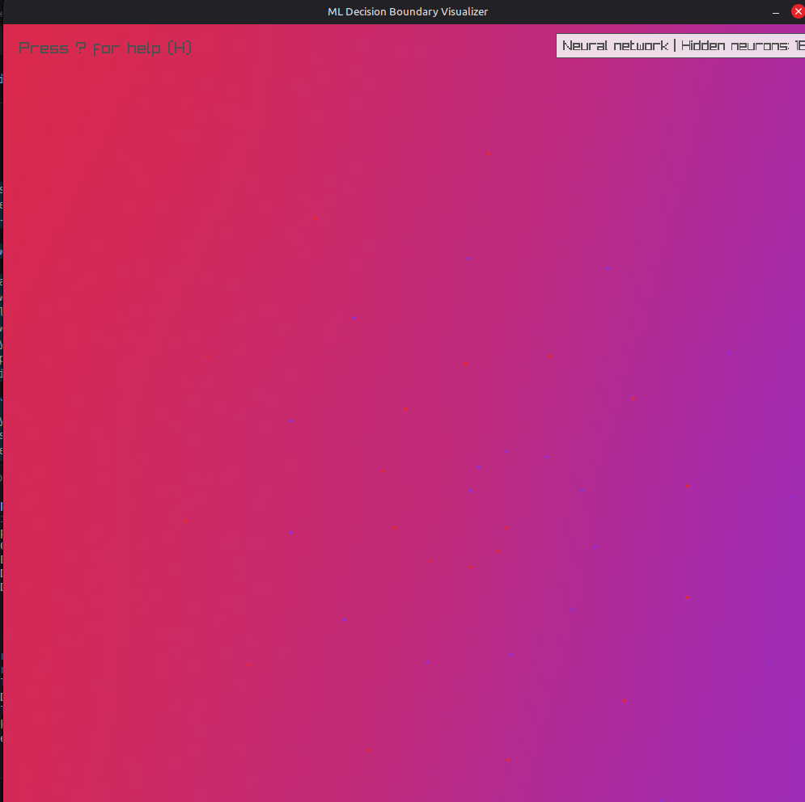
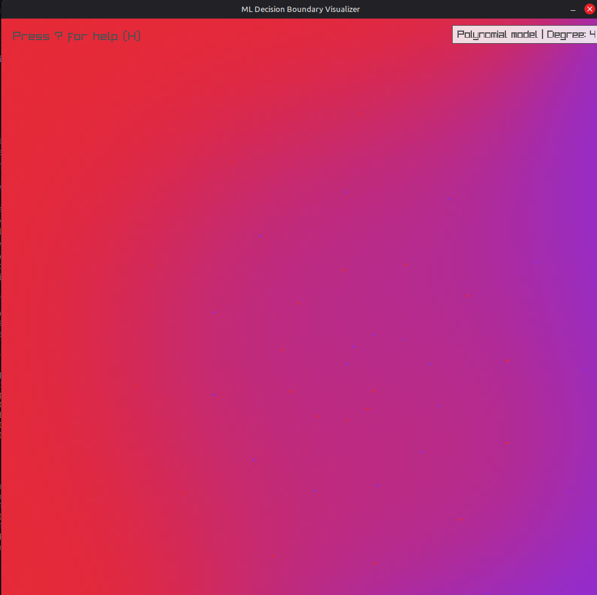
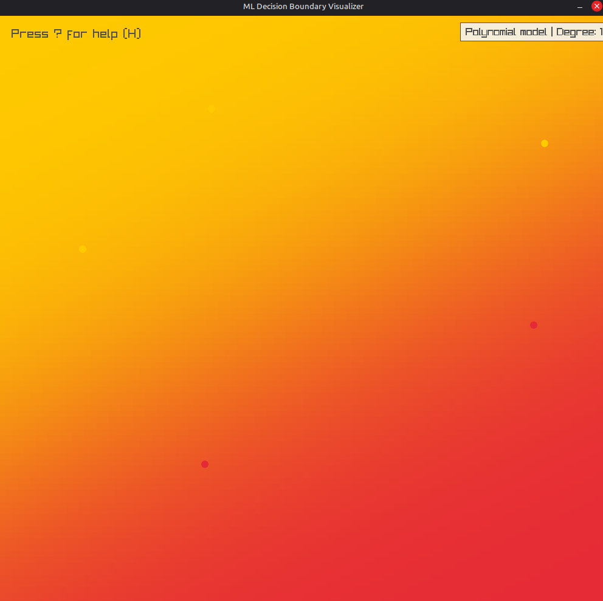
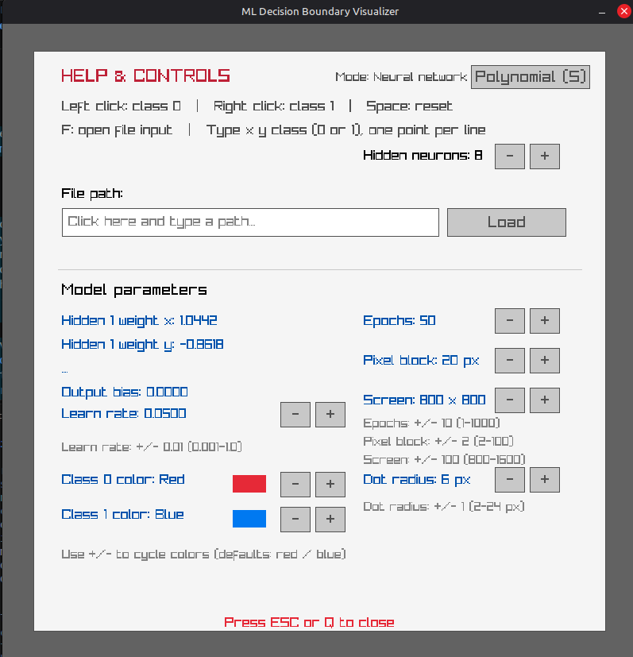
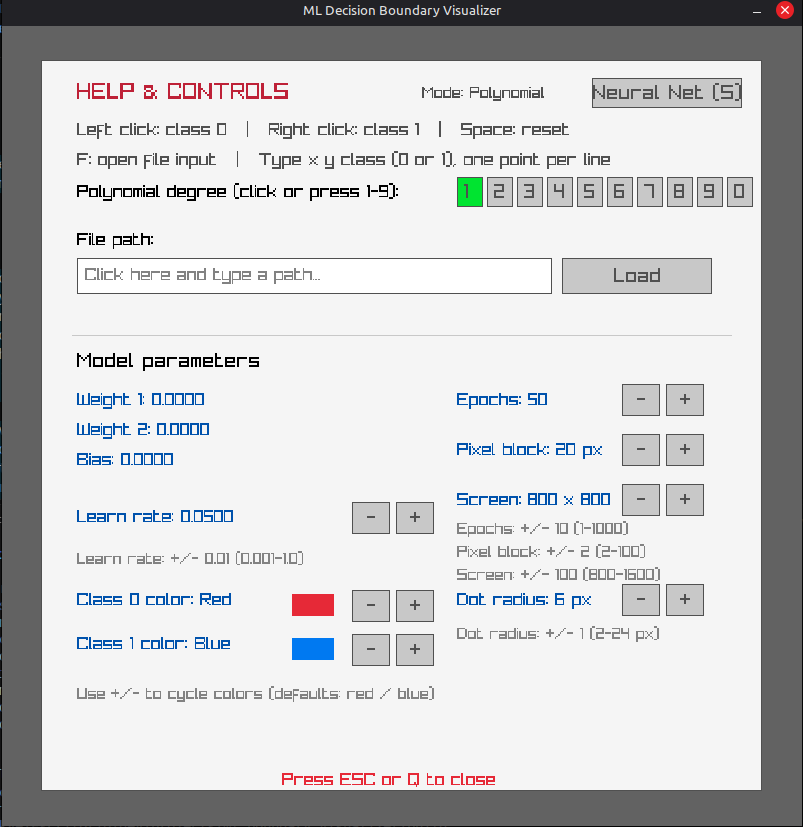

# ML Decision Boundary Visualizer


An interactive, real-time C++17 application for exploring binary classification and decision boundaries. Place points interactively on the canvas or load custom 2D datasets, then watch Polynomial Classifiers and Neural Networks render soft probability fields across the feature space in real time.



---

## Screenshots

<table>
  <tr>
    <td align="center" width="50%">
      
      <br><sub><b>Neural Network Mode</b><br>Non-linear boundary formed on a complex dataset</sub>
    </td>
    <td align="center" width="50%">
      
      <br><sub><b>Polynomial Mode</b><br>Higher-degree feature expansion boundary comparison</sub>
    </td>
  </tr>
  <tr>
    <td align="center" width="50%">
      
      <br><sub><b>Interactive Canvas & HUD</b><br>Real-time point placement with live telemetry</sub>
    </td>
    <td align="center" width="50%">
      
      <br><sub><b>Settings Panel (Neural Network)</b><br>Configurable hidden neurons, learning rate, and epochs</sub>
    </td>
  </tr>
  <tr>
    <td align="center" colspan="2">
      
      <br><sub><b>Settings Panel (Polynomial)</b><br>Degree selection and display resolution settings</sub>
    </td>
  </tr>
</table>

---

## Features

- **Dual Model Architecture:** Toggle instantly between a **Polynomial Classifier** (Degrees 1–10) and a **Neural Network** (1–64 hidden neurons).
- **Interactive Canvas:** Add class 0 (left-click) and class 1 (right-click) points dynamically and observe live boundary updates.
- **Custom Dataset Loading:** Load 2D classification datasets directly from space-delimited text files.
- **On-the-Fly Hyperparameter Tuning:** Adjust learning rate, training epochs, pixel-block resolution, canvas dimensions, dot radius, and class display colors.
- **Lazy Retraining Engine:** Models retrain on data or parameter updates rather than per-frame, ensuring high rendering performance.

---

## Build and Run

### Requirements
- **C++17** compatible compiler (`gcc`, `clang`, or `MSVC`)
- **CMake** 3.15 or newer
- Desktop graphics environment with OpenGL support

> **Note:** CMake fetches Raylib automatically during initial build configuration. An active internet connection is required for the first configuration step.

### Build Steps

```sh
# Clone the repository
git clone https://github.com/KyeRogers/Interactive_Ml_Decision_Boundary_Visualizer.git
cd ml_boundary_visualizer

# Configure and build
cmake -S . -B build
cmake --build build

# Run the executable
./build/ml_boundary_visualizer
```

---

## Controls

| Input | Action |
| :--- | :--- |
| **Left Click** | Add **Class 0** point |
| **Right Click** | Add **Class 1** point |
| **S** | Toggle between **Polynomial** and **Neural Network** models |
| **1–9, 0** | Select Polynomial Degree 1–9 (`0` selects Degree 10) |
| **Space** | Clear all points and reset model parameters |
| **H** or **?** | Toggle Settings & Help panel |
| **F** | Focus data file input box |
| **Esc** / **Q** | Close settings panel or exit |

---

## Loading Point Files

Point data files store screen coordinates and a binary class label (`0` or `1`) per line, separated by spaces:

```text
x y class
```

### Example (`data/readme_ring_pattern.txt`)

```text
120 240 0
150 210 0
620 510 1
590 540 1
```

Coordinates should fall within the current screen resolution dimensions.

---

## Architecture Overview

```text
┌─────────────────────────────────────────────────────────────────┐
│                            Renderer                             │
│       (Raylib Window, Event Loop, UI Panel, Probability Grid)   │
└───────────────────────────────┬─────────────────────────────────┘
                                │
                                ▼
┌─────────────────────────────────────────────────────────────────┐
│                            Simulator                            │
│      (Point Data, Model Ownership, Training Loop, Grid Cache)   │
└───────────────────────────────┬─────────────────────────────────┘
                                │
                   ┌────────────┴────────────┐
                   ▼                         ▼
      ┌─────────────────────────┐ ┌─────────────────────────┐
      │     PolynomialModel     │ │   NeuralNetworkModel    │
      │  (Feature Map Degree N) │ │ (1 Hidden Layer, Cache) │
      └─────────────────────────┘ └─────────────────────────┘
```

- **`MlModel`**: Polymorphic abstract base class specifying uniform `Predict()`, `Train()`, `Reset()`, `SetLearningRate()`, and `GetParameters()` interfaces.
- **`PolynomialModel`**: Expands input 2D coordinates into higher-degree polynomial features for linear classification.
- **`NeuralNetworkModel`**: Implements a configurable single-hidden-layer feedforward neural network with forward activation caching.
- **`Simulator`**: Manages dataset storage, model execution state, file operations, and probability grid generation.
- **`Renderer`**: Handles the Raylib display window, user inputs, UI panels, and color blending for the decision grid.

---

## License

Distributed under the MIT License. See `LICENSE` for details.