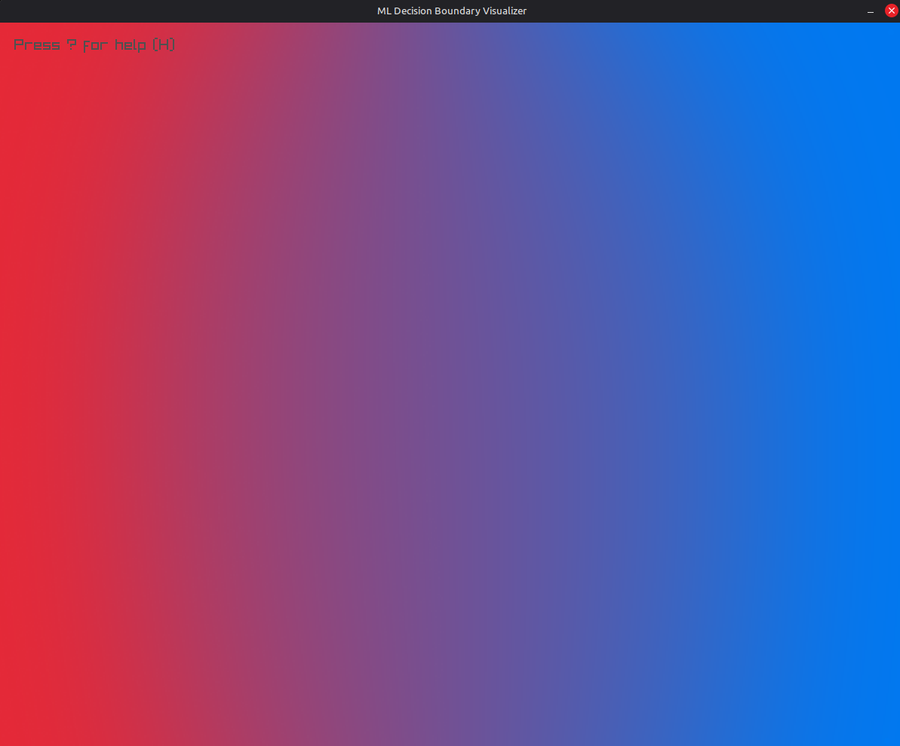
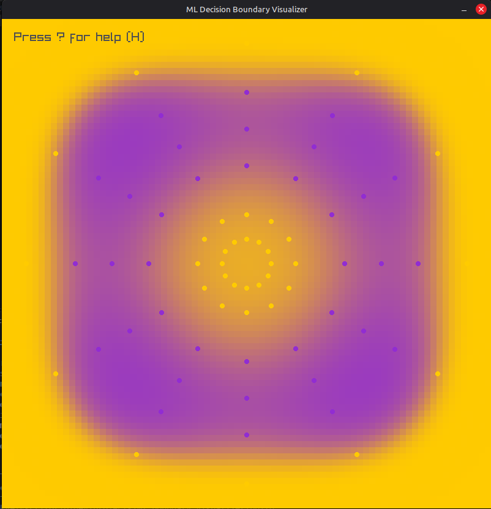
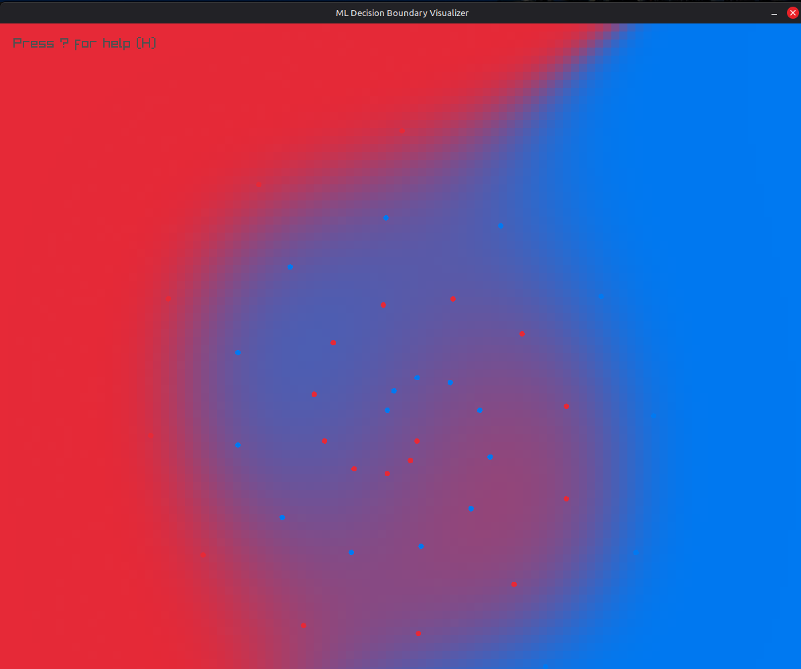
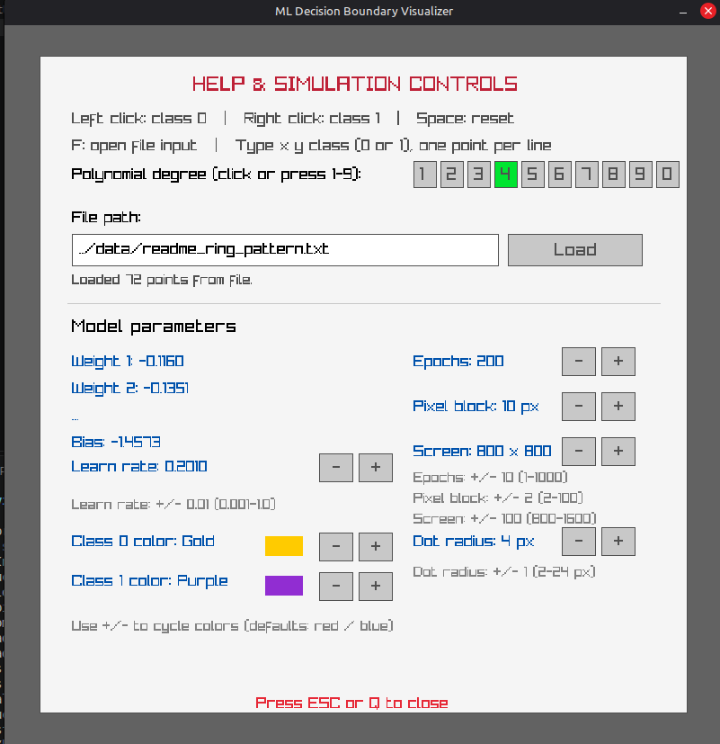

# ML Decision Boundary Visualizer

A small C++17 application for exploring binary classification and polynomial
decision boundaries. Add points interactively or load them from a text file,
then watch the model's predicted probabilities appear as a colored grid.

## Screenshots

<table>
  <tr>
    <td align="center">
      
      <br><sub>Place points from either class and see the boundary update.</sub>
    </td>
    <td align="center">
      
      <br><sub>A nonlinear, ring-like pattern from the polynomial model.</sub>
    </td>
  </tr>
  <tr>
    <td align="center">
      
      <br><sub>Predicted class probabilities blend between the selected colors.</sub>
    </td>
    <td align="center">
      
      <br><sub>The help panel contains data loading, model settings, and display controls.</sub>
    </td>
  </tr>
</table>

## Build and run

Requirements: CMake 3.15 or newer, a C++17 compiler, and a desktop environment
with graphics support. CMake fetches Raylib from GitHub during configuration,
so an internet connection is needed the first time you configure the project.

From the project directory:

```sh
cmake -S . -B build
cmake --build build
./build/ml_boundary_visualizer
```

## Controls

- **Left click:** add a class 0 point.
- **Right click:** add a class 1 point.
- **Space:** clear all points and reset the model parameters.
- **H** or **?**: open the help and settings panel; **Esc** or **Q** closes it.
- **1–9**: select polynomial degrees 1–9 at any time; **0** selects degree 10.
- **F** or the file input field: enter a data-file path, then press **Enter** or
  click **Load**.
- Click the degree buttons to choose a polynomial degree from the help panel.
- Use the panel's **+ / -** buttons to adjust learning rate, epochs, pixel-block
  size, screen size, dot radius, and the class colors.

The degree range is 1–10. Learning rate is bounded from 0.001 to 1.0, epochs
from 1 to 1000, pixel-block size from 2 to 100, screen size from 800 to 1600
pixels, and dot radius from 2 to 24 pixels. The default screen is 800 × 800;
the default pixel block is 20 pixels.

The model trains when data or a training setting changes instead of repeating
the full training pass every frame. Changes made while the help panel is open
are trained when the panel closes. The probability grid is not recalculated
while the help panel is open. Larger pixel blocks render faster but make the
boundary less detailed.

## Loading point files

Each line contains screen-pixel coordinates and a binary class:

```text
x y class
```

For example:

```text
120 240 0
620 510 1
```

Coordinates should be within the current square screen, and class must be `0`
or `1`. The bundled [`data/readme_ring_pattern.txt`](data/readme_ring_pattern.txt)
is a ready-to-load example.

### Recreate the ring pattern

Load `data/readme_ring_pattern.txt` at 800 × 800, then set degree **4**, learning
rate **0.20**, **200** epochs, **10 px** pixel blocks, and **4 px** dot radius.
Set class 0 to **Purple** and class 1 to **Gold**, then close the help panel and
let training finish. Load the data file before changing learning rate or
epochs, since loading resets those settings.

## How it works

`Simulator` owns the data, model, training, file loading, and probability-grid
generation. `PolynomialModel` expands the two input coordinates into polynomial
features through the selected degree and predicts a binary-class probability.
The renderer colors each grid cell by blending the chosen class colors
according to that probability. `Renderer` handles the Raylib window, controls,
help panel, and drawing; `DataPoint` stores each point and its class.
